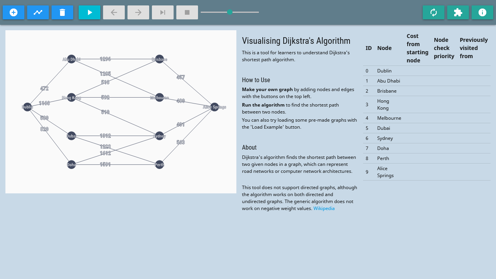

# Visualisation of Dijkstra's Shortest Path Algorithm  

A web application for a school project - Development of a Software Application for Teaching Computer Networking.

## What is this?
The application is a tool to help students visualise how Dijkstra's algorithm runs.

Dijkstra's algorithm finds the shortest path between two points in a network, and variants of it are used widely in maps, internet networking, finding cheapest costs of a flight, etc. See [the Wikipedia article](https://en.wikipedia.org/wiki/Dijkstra%27s_algorithm) for more information.

This application lets you:
- Create your own graph networks
- Calculate the best (lowest cost) path between two points in the network
- Watch the algorithm work it out step-by-step, with explanations

[Try it out here](https://tanxh33.github.io/visualise-dijkstra/).

---
## About the code
Built in JavaScript, with [MaterializeCSS](https://materializecss.com/).

Code for weighted graph implemented with reference to this article by Maiko Miyazaki: [Completed JavaScript Data Structure Course, and Here is What I Learned About Graph (+ Dijkstra Algorithm)](https://dev.to/maikomiyazaki/completed-javascript-data-structure-course-and-here-is-what-i-learned-about-graph-dijkstra-algorithm-57n8).

A more refactored version of this project, made with TypeScript, can be found in [a newer repo](https://tanxh33.github.io/visualise-dijkstra-ts/).

---

Tested on Firefox version 86.0 and Chrome version 88.0.4324.190.